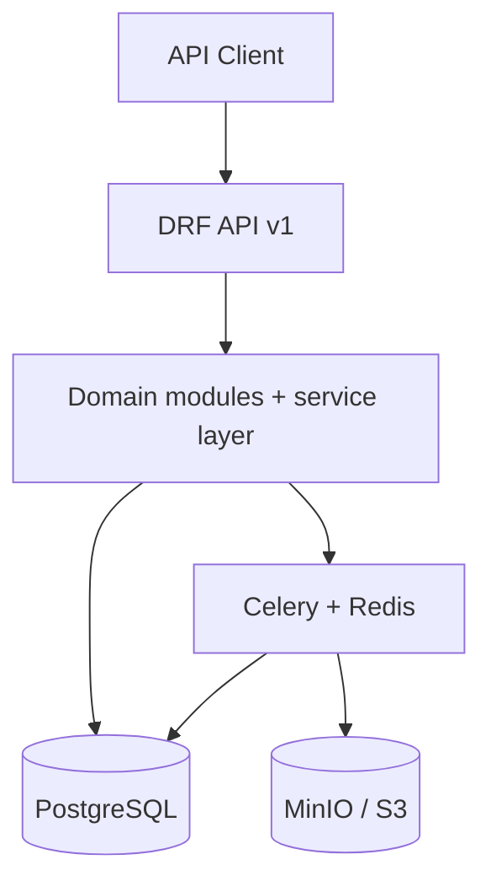
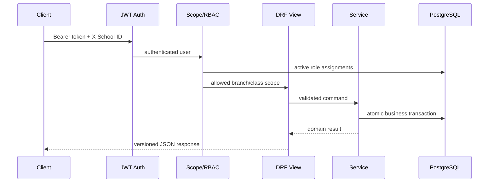

# معماری نرم‌افزار

## سبک معماری

Modular Monolith انتخاب شده است. هر دامنه مدل، Serializer، View، Service و Task خودش را دارد، اما همه در یک Deployment و یک PostgreSQL قرار می‌گیرند. این انتخاب برای تیم Python، مقیاس فعلی ۱۳ شعبه و نیاز به تراکنش‌های قوی بین ثبت‌نام/نمره مناسب است.

## مرز ماژول‌ها

| ماژول | مسئولیت | نباید انجام دهد |
|---|---|---|
| `core` | Base model، Audit، logging، health، خطای استاندارد | منطق آموزشی |
| `accounts` | Custom User، JWT، RBAC و دامنه دسترسی | محاسبه نمره |
| `organizations` | مجموعه، شعبه، سال، نوبت، پایه، کلاس | ذخیره دانش‌آموز |
| `students` | دانش‌آموز، ولی، ثبت‌نام و انتقال | تعریف نمره |
| `academics` | درس، ارائه، ارزیابی، نمره، workflow و calculation | تولید فایل گزارش |
| `imports` | خواندن قالب ثابت، اعتبارسنجی و ثبت اتمیک | پذیرش Excel نامنظم |
| `reports` | Snapshot، HTML/PDF و آرشیو | تغییر داده آموزشی |
| `dashboard` | Read model و شاخص عملیاتی | ثبت داده دامنه |

## مسیر درخواست امن

## جداسازی شعبه

سه لایه هم‌زمان اعمال می‌شود:

1. `selected_school_ids()` هدر شعبه را با تخصیص‌های کاربر تقاطع می‌دهد.
2. `get_queryset()` هر Resource را از ابتدا به شعب/کلاس‌های مجاز محدود می‌کند.
3. Serializer و Object Permission مقصد عملیات نوشتن را دوباره کنترل می‌کنند.

برای دبیر، محدوده یک مرحله دقیق‌تر است: ارائه درس باید `teacher=request.user` باشد. دسترسی به دانش‌آموزان در سطح کلاس‌های تدریس‌شده است، ولی ارزیابی و نمره فقط برای درس خود دبیر نمایش داده می‌شود.

## تراکنش و هم‌زمانی

- تغییر کلاس، انتقال، Import، ثبت گروهی نمره و تغییر workflow اتمیک‌اند.
- در ظرفیت کلاس و ویرایش نمره از `select_for_update` استفاده می‌شود.
- Task بعد از Commit صف می‌شود تا Worker داده Commit‌نشده را نخواند.
- تولید PDF قفل پایگاه داده را در مدت Render نگه نمی‌دارد.
- Report و Import وضعیت صریح `queued/processing/completed/failed` دارند.

## پردازش غیرهم‌زمان

| Queue | کارها | دلیل |
|---|---|---|
| `imports` | خواندن و ثبت فایل‌های XLSX | جلوگیری از Block شدن API |
| `reports` | تولید PDF فردی/گروهی | CPU و I/O بیشتر |
| `calculations` | محاسبه مجدد کلاس بعد از قفل | جداسازی بار محاسباتی |
| `default` | کارهای عمومی آینده | مسیر امن پیش‌فرض |

## مسیر رشد

در نسخه پیشرفته، ماژول‌های attendance، behavior، activities و alerts به همین Monolith اضافه می‌شوند. جداسازی Microservice فقط وقتی توجیه دارد که یک مرز بار/تیم مستقل شکل بگیرد؛ مثال محتمل Worker گزارش یا Analytics است. شناسه‌های UUID و Snapshot گزارش، این جداسازی آینده را ساده می‌کنند.
