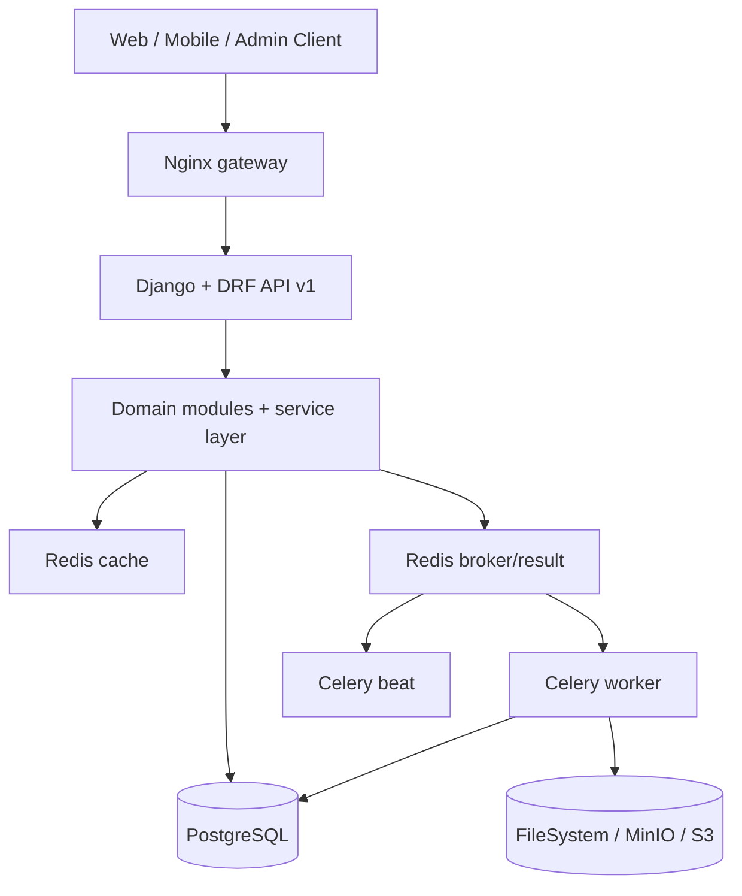
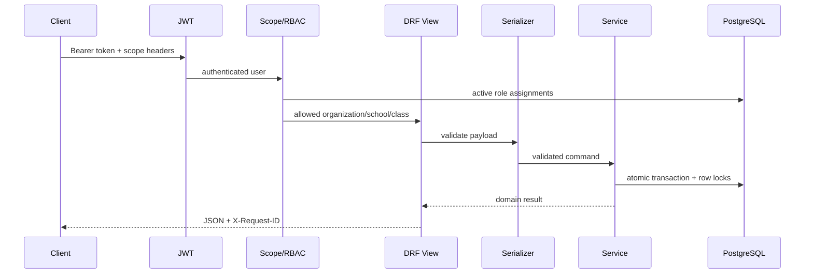

# معماری نرم‌افزار

## سبک معماری

Backend یک Modular Monolith مبتنی بر Django و DRF است. هر دامنه Model، Serializer، View، Service و Task خودش را دارد، اما همه در یک Deployment و یک PostgreSQL قرار می‌گیرند. این انتخاب برای مقیاس فعلی، تیم Python و نیاز به تراکنش قوی بین ثبت‌نام، نمره، حضور و گزارش مناسب است.

## مرز ماژول‌ها

| ماژول | مسئولیت | وابستگی مجاز اصلی | نباید انجام دهد |
|---|---|---|---|
| `core` | Base model، soft delete، Audit، logging، health، tenancy | Django | منطق آموزشی |
| `organizations` | مجموعه، شعبه، سال، نوبت، پایه، کلاس | `core` | ذخیره نمره یا حضور |
| `accounts` | User، JWT، RBAC و Scope | `core`, `organizations` | محاسبه آموزشی |
| `students` | دانش‌آموز، ولی، ثبت‌نام و انتقال | `organizations`, `accounts` | تعریف ارزیابی |
| `academics` | درس، ارائه، ارزیابی، نمره، workflow و calculation | `students`, `organizations`, `accounts` | تولید فایل گزارش |
| `attendance` | جلسه، roster، رکورد، عذر، هشدار و outbox اعلان | `students`, `academics`, `accounts` | ارسال مستقیم بدون outbox |
| `imports` | XLSX ثابت، اعتبارسنجی و ثبت اتمیک | دامنه‌های مقصد | پذیرش فایل آزاد و نامنظم |
| `reports` | Snapshot، HTML/PDF و آرشیو | `academics`, `students` | تغییر داده آموزشی |
| `dashboard` | Read model و شاخص عملیاتی | دامنه‌های خواندنی | ثبت داده دامنه |

## مسیر درخواست امن

Scope فقط در UI کنترل نمی‌شود. چهار لایه دفاعی وجود دارد:

1. `accessible_*` و `selected_school_ids()` حوزه مجاز را از RoleAssignment می‌سازند.
2. `get_queryset()` داده خارج از Scope را از ابتدا حذف می‌کند.
3. `RolePermission` هدر، action، نقش و object را کنترل می‌کند.
4. Serializer و Service سازگاری Tenant و invariantهای دامنه را دوباره بررسی می‌کنند.

## خواندن و نوشتن چندشعبه‌ای

- خواندن بدون هدر، همه شعب مجاز کاربر را پوشش می‌دهد.
- نوشتن بدون Scope صریح فقط برای `system_admin` مجاز است.
- `X-School-ID` باید داخل حوزه کاربر باشد.
- اگر `X-Organization-ID` و `X-School-ID` هم‌زمان ارسال شوند، مجموعه باید مالک همان شعبه باشد.
- دبیر فقط کلاس‌های CourseOffering خودش را می‌بیند؛ در ارزیابی و نمره، مالکیت درس نیز کنترل می‌شود.

## تراکنش و هم‌زمانی

- تغییر کلاس، انتقال، Import، bulk score، workflow نمره، Attendance bulk/finalize و alert evaluation اتمیک‌اند.
- ظرفیت کلاس و mutationهای حساس با `select_for_update` محافظت می‌شوند.
- Taskها با `transaction.on_commit` صف می‌شوند تا داده Commit‌نشده را نبینند.
- تولید PDF خارج از قفل طولانی دیتابیس انجام می‌شود.
- Jobهای Import، Report و Notification وضعیت صریح و timeout بازیابی دارند.

## پردازش غیرهم‌زمان

| Queue | Task | رفتار شکست |
|---|---|---|
| `imports` | `process_import_job_task` | retry محدود و Job `failed` |
| `reports` | `generate_report_task` | retry خطاهای I/O و claim/idempotency |
| `calculations` | `recalculate_class_term_task` | retry با backoff |
| `notifications` | `dispatch_parent_notification` | claim، backoff، max attempts و dead-letter |
| `default` | کارهای عمومی | مسیر fallback Worker |

Celery Beat در حال حاضر ارزیابی روزانه هشدار Attendance را زمان‌بندی می‌کند. پاک‌سازی فایل‌های منقضی و dispatch دوره‌ای اعلان‌های آماده retry باید با Scheduler زیرساخت یا Job جدا اجرا شوند.

## توپولوژی استقرار

- `release`: Migration و collectstatic یک‌بارمصرف
- `web`: Gunicorn API
- `gateway`: Nginx و سرو فایل‌های static/media محلی
- `worker`: همه Queueهای Celery
- `beat`: Scheduler هشدارها
- `db`: PostgreSQL
- `redis-cache`: Cache با eviction
- `redis-broker`: Broker/Result با `noeviction`
- `minio` و `minio-init`: فقط در profile `s3`
- `backup-db`, `backup-media`, `backup-storage`: بکاپ دوره‌ای

## مسیر رشد

مرزهای ماژول‌ها برای Extract آینده حفظ شده‌اند، اما جداسازی سرویس فقط زمانی توجیه دارد که بار، تیم یا چرخه استقرار مستقل شکل بگیرد. Worker گزارش، Notification gateway و Analytics محتمل‌ترین مرزهای آینده‌اند. UUID عمومی، outbox اعلان و Snapshot گزارش این جداسازی را ساده‌تر می‌کنند.
