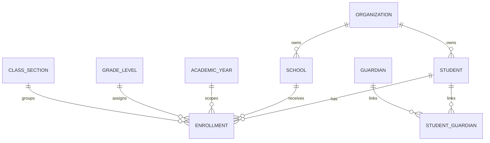
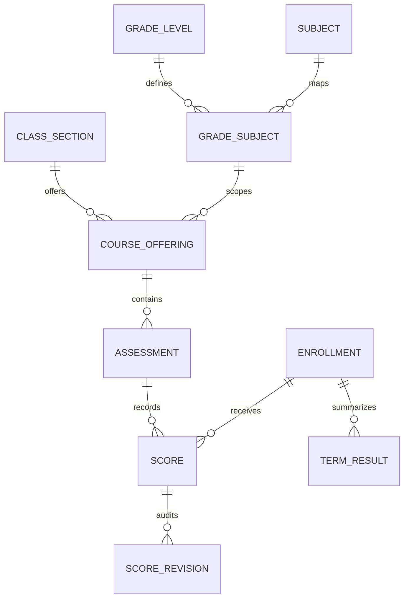

# مدل داده و قواعد محاسبات

## هسته ثبت‌نام

دانش‌آموز هیچ FK دائمی به کلاس ندارد. ارتباط کلاس فقط در `Enrollment` و همراه سال تحصیلی نگهداری می‌شود. انتقال در همان سال، ثبت‌نام مبدأ را `transferred` و ثبت‌نام مقصد را `active` می‌کند؛ هر دو باقی می‌مانند.

## هسته آموزشی

## قیود مهم دیتابیس

- کد ملی دانش‌آموز در هر مجموعه یکتا است.
- فقط یک Enrollment فعال برای دانش‌آموز و سال وجود دارد.
- شماره دانش‌آموزی در شعبه/سال یکتا است.
- کلاس، سال، پایه و شعبه Enrollment باید سازگار باشند.
- یک درس پایه فقط یک‌بار تعریف می‌شود.
- یک ارائه درس برای کلاس/درس/نوبت یکتا است.
- هر دانش‌آموز برای هر Assessment فقط یک Score دارد.
- مقدار نمره منفی در DB غیرممکن است؛ سقف نمره در Domain validation کنترل می‌شود.
- Assessment قفل‌شده از API عادی قابل تغییر نیست.

## وضعیت نمره

| مقدار | معنی | رفتار محاسباتی پیش‌فرض |
|---|---|---|
| `present` | نمره ثبت شده | نرمال‌سازی و ورود به میانگین |
| `excused_absent` | غیبت موجه | حذف از مخرج |
| `unexcused_absent` | غیبت غیرموجه | صفر، قابل تنظیم در Policy |
| `not_entered` | هنوز ثبت نشده | حذف از محاسبه و شمارش در داشبورد |

## فرمول

هر نمره ابتدا به مقیاس ۲۰ تبدیل می‌شود:

\[
N_i = \frac{raw_i}{max_i} \times 20
\]

میانگین درس در یک نوبت:

\[
SubjectAverage = \frac{\sum(N_i \times weight_i)}{\sum weight_i}
\]

معدل نوبت:

\[
TermAverage = \frac{\sum(SubjectAverage_j \times coefficient_j)}{\sum coefficient_j}
\]

گردکردن فقط در مرز نتیجه و با `Decimal` انجام می‌شود. حالت‌های `half_up`، `half_even` و `down` و صفر تا چهار رقم اعشار پشتیبانی می‌شوند.

رتبه کلاس Dense است: معدل‌های مساوی رتبه برابر دارند و رتبه بعدی بر اساس موقعیت واقعی محاسبه می‌شود. رتبه فقط بین Enrollmentهای فعال همان کلاس/نوبت ساخته می‌شود.

## نسخه‌پذیری

`CalculationPolicy` می‌تواند عمومی مجموعه، مخصوص سال، مخصوص پایه یا مخصوص سال+پایه باشد. انتخاب از خاص‌ترین به عمومی‌ترین انجام می‌شود. `formula_version` در `SubjectResult`، `TermResult` و Report Archive ثبت می‌شود تا خروجی رسمی بعداً قابل بازسازی و Audit باشد.

## Snapshot گزارش

PDF فقط به فایل وابسته نیست. داده دقیق استفاده‌شده برای ساخت گزارش در JSON `ReportArchive.snapshot` ذخیره می‌شود. بنابراین تغییر بعدی نام کلاس یا نمره، مفهوم گزارش قدیمی را تغییر نمی‌دهد.
