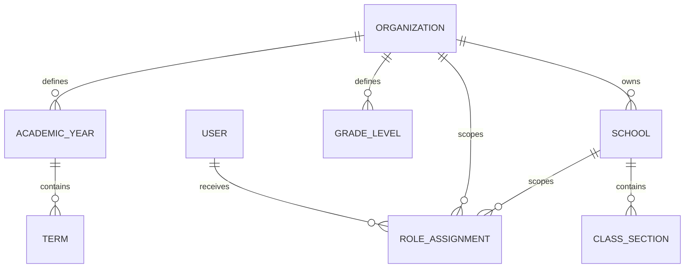
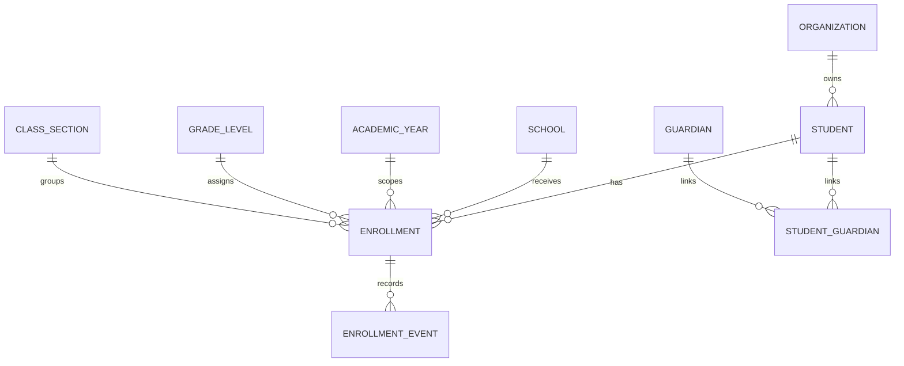
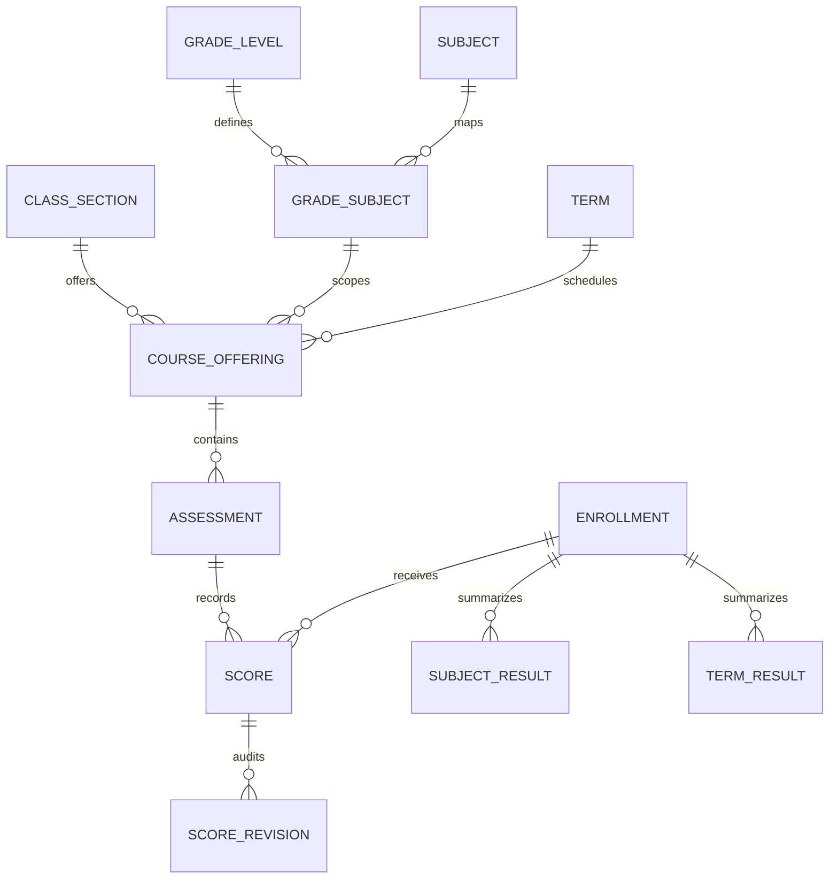
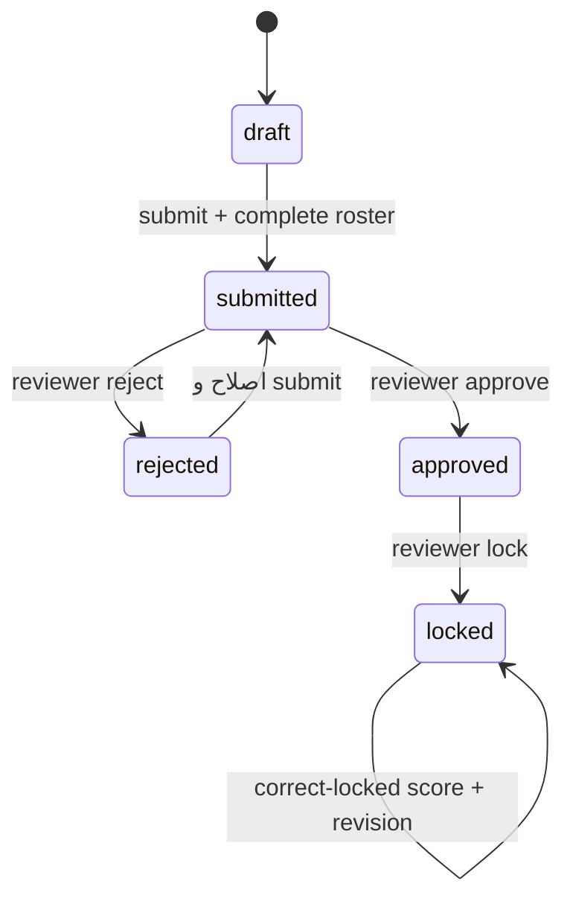
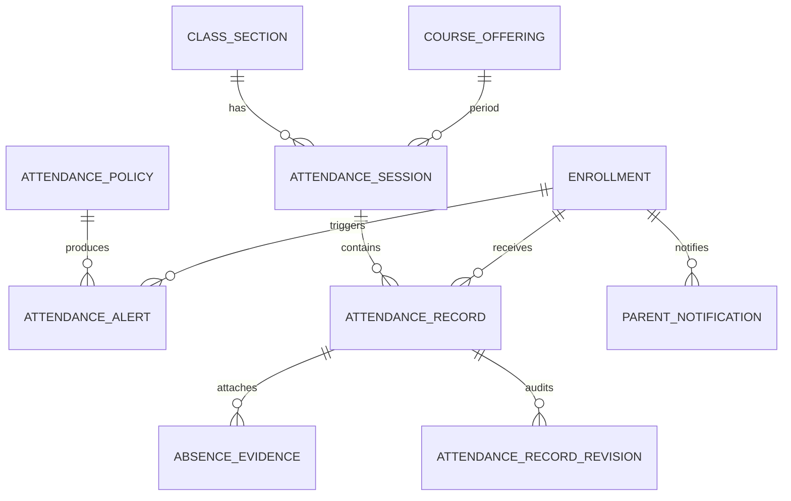

# مدل داده و قواعد دامنه

## اصول عمومی

- شناسه عمومی مدل‌های دامنه UUID است.
- داده‌های اصلی دامنه از `SoftDeleteModel` استفاده می‌کنند؛ تاریخچه و Snapshot حذف فیزیکی نمی‌شوند.
- رابطه‌های حساس عمدتاً `PROTECT` هستند تا حذف، تاریخچه رسمی را خراب نکند.
- زمان‌های ایجاد/ویرایش در مدل پایه نگهداری می‌شوند.
- constraint دیتابیس مکمل validation دامنه است، نه جایگزین آن.

## سازمان و دسترسی

قواعد مهم:

- کد مجموعه یکتا است.
- کد شعبه در مجموعه یکتا است.
- فقط یک سال جاری فعال در هر مجموعه وجود دارد.
- کد و ترتیب پایه در مجموعه یکتا است.
- کد کلاس در شعبه/سال یکتا است.
- Scope نقش باید با نوع نقش سازگار باشد؛ نقش سیستمی، مجموعه‌ای و شعبه‌ای constraint جدا دارند.

## دانش‌آموز و ثبت‌نام

دانش‌آموز FK دائمی به کلاس ندارد. عضویت کلاس فقط در Enrollment و بازه زمانی آن ثبت می‌شود. تغییر کلاس، Enrollment قبلی را می‌بندد و Enrollment جدید می‌سازد؛ انتقال شعبه نیز مبدأ و مقصد را نگه می‌دارد.

قیود:

- کد ملی دانش‌آموز در هر مجموعه یکتا است.
- در هر سال فقط یک Enrollment فعال برای دانش‌آموز وجود دارد.
- شماره دانش‌آموزی فعال در شعبه/سال یکتا است.
- شعبه، سال، پایه و کلاس Enrollment باید متعلق به یک مجموعه و بازه سازگار باشند.
- کاهش ظرفیت کلاس پایین‌تر از تعداد Enrollment فعال رد می‌شود.
- تاریخ خروج/تغییر نمی‌تواند قبل از تاریخ ورود باشد.

## آموزش و نمره

قیود:

- Subject code و AssessmentType code در مجموعه یکتا هستند.
- GradeSubject برای هر پایه/درس یکتا است.
- CourseOffering برای کلاس/درس/نوبت یکتا است.
- Assessment برای offering/title/date یکتا است.
- هر Enrollment برای هر Assessment یک Score دارد.
- نمره منفی در دیتابیس مجاز نیست؛ سقف در validation کنترل می‌شود.
- CalculationPolicy فعال در هر Scope فقط یکی است.

### state machine ارزیابی

ویرایش عادی پس از Lock مسدود است. اصلاح استثنایی نمره قفل‌شده Assessment را Unlock نمی‌کند و ScoreRevision مستقل می‌سازد.

### وضعیت نمره

| مقدار | معنی | رفتار محاسباتی پیش‌فرض |
|---|---|---|
| `present` | نمره ثبت‌شده | نرمال‌سازی و ورود به میانگین |
| `excused_absent` | غیبت موجه | حذف از مخرج |
| `unexcused_absent` | غیبت غیرموجه | صفر، قابل تنظیم در Policy |
| `not_entered` | ثبت نشده | حذف از محاسبه و علامت ناقص |

### فرمول

هر نمره به مقیاس ۲۰ تبدیل می‌شود:

\[
N_i = \frac{raw_i}{max_i} \times 20
\]

میانگین درس:

\[
SubjectAverage = \frac{\sum(N_i \times weight_i)}{\sum weight_i}
\]

معدل نوبت:

\[
TermAverage = \frac{\sum(SubjectAverage_j \times coefficient_j)}{\sum coefficient_j}
\]

تمام محاسبات Decimal هستند. گردکردن فقط در مرز نتیجه با `half_up`، `half_even` یا `down` و صفر تا چهار رقم اعشار انجام می‌شود. رتبه کلاس Dense است؛ نمره‌های برابر رتبه برابر دارند و رتبه بعدی پرش نمی‌کند.

## حضور و غیاب

Session دو Scope دارد: `daily` و `period`. وضعیت‌ها `draft`, `finalized`, `cancelled` هستند. رکوردها `present`, `absent_excused`, `absent_unexcused` و workflow عذر `not_required`, `pending`, `approved`, `rejected` دارند.

قواعد:

- جلسه روزانه برای کلاس/تاریخ یکتا است.
- جلسه زنگ برای کلاس/تاریخ/شماره زنگ یکتا است.
- هر Enrollment در هر Session یک رکورد دارد.
- roster بر اساس عضویت معتبر در تاریخ جلسه ساخته می‌شود.
- finalize فقط با roster کامل مجاز است.
- Session نهایی فقط از مسیر correction و همراه revision تغییر می‌کند.
- درخواست عذر تا زمان approval در محاسبه، غیرموجه باقی می‌ماند.
- هشدار فقط از Sessionهای نهایی محاسبه می‌شود.
- هشدار open/acknowledged تکراری برای Scope فعال ساخته نمی‌شود.
- ParentNotification با dedupe key و وضعیت‌های queue تا dead-letter کنترل می‌شود.

## Import و Report

`ImportJob` شامل نوع، checksum، فایل، وضعیت، شمارنده‌ها و خطاهای ردیفی است. فایل تکراری فعال در Scope یکسان با unique constraint رد می‌شود.

`ReportArchive` شامل Scope، نوع، وضعیت، Snapshot JSON، نسخه فرمول و فایل خروجی است. Snapshot باعث می‌شود تغییر بعدی نام کلاس یا نمره، معنای گزارش رسمی قبلی را تغییر ندهد.

## Audit

`AuditEvent` actor، action، entity، Scope، Request ID، IP و metadata/changes پالایش‌شده را نگه می‌دارد. فیلدهای حساس مانند password، national ID، phone، email، address، note و reason در Audit عمومی redacted یا حذف می‌شوند.
