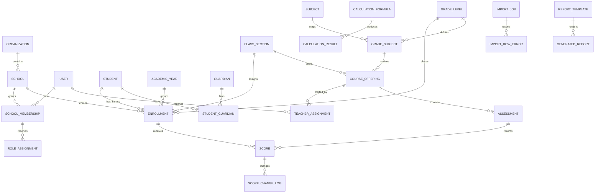

# MVP ERD

The authoritative enrollment relationship is:

## Initial decisions

- Internal primary keys use `BigAutoField`; public opaque identifiers can be introduced per aggregate when API enumeration risk justifies them.
- `Student` has no permanent class or grade foreign key.
- Annual uniqueness and school consistency are enforced by database constraints and transactional services.
- Score values use `Decimal`, never binary floating point.
