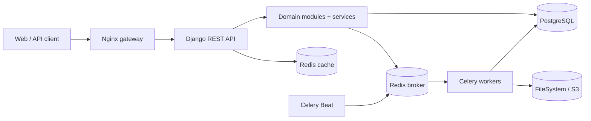

# HamAmoz Platform

Backend نسخهٔ MVP سامانهٔ تحت وب مدیریت آموزشی چندشعبه‌ای هم‌آموز؛ ساخته‌شده با
Django REST Framework و معماری Modular Monolith.

این پروژه گردش‌کارهای اصلی یک مجموعهٔ آموزشی را از مدیریت شعبه، کلاس و ثبت‌نام
تا نمره، حضور و غیاب، گزارش و اعلان والدین پوشش می‌دهد. جداسازی دادهٔ شعبه‌ها در
لایه‌های Query، Permission، Service، Task و Export اعمال می‌شود.

> [!IMPORTANT]
> سورس Backend در حال حاضر روی شاخهٔ `backend/mvp-bootstrap` نگهداری می‌شود.
> شاخهٔ `main` نقطهٔ یکپارچه‌سازی است و تغییرات فقط از طریق Pull Request وارد آن
> می‌شوند.

## قابلیت‌ها

- مدیریت مجموعه، ۱۳ شعبهٔ نمونه، سال تحصیلی، نوبت، پایه، کلاس و ظرفیت
- کاربر سفارشی، احراز هویت JWT، چرخش و blacklist توکن و نقش‌های وابسته به حوزه
- مدیریت دانش‌آموز، ولی، ارتباط چندفرزندی، ثبت‌نام تاریخ‌مند، انتقال و تغییر کلاس
- تعریف درس، ارائهٔ درس، دبیر، ارزیابی، ثبت گروهی نمره و گردش تأیید نمرات
- محاسبهٔ نمرهٔ نرمال‌شده، معدل، قبولی و رتبهٔ Dense با سیاست نسخه‌دار
- ورود اتمیک فایل‌های XLSX برای دانش‌آموز، ثبت‌نام، نمره و ارزیابی ماهانه
- حضور و غیاب روزانه یا زنگ، توجیه غیبت، هشدار و اعلان والدین
- تولید و آرشیو کارنامهٔ فارسی HTML/PDF و داشبورد عملیاتی
- Audit trail، لاگ JSON، Health Check و اتصال اختیاری Sentry
- PostgreSQL، Redis، Celery، ذخیره‌سازی محلی یا MinIO/S3 و پشتیبان‌گیری دوره‌ای
- قرارداد OpenAPI، Swagger UI و ReDoc

## فناوری‌ها و پیش‌نیازها

روش مرجع اجرا Docker است و فقط به Git و Docker Engine به‌همراه Compose plugin
نیاز دارد. Compose سرویس‌های PostgreSQL 17، Redis 7.4، Nginx، Django، Celery
Worker و Celery Beat را ایجاد می‌کند. MinIO با profile اختیاری `s3` فعال می‌شود.

برای توسعهٔ بدون Docker به Python `>=3.12,<3.14`، PostgreSQL و Redis نیاز است.
SQLite فقط برای توسعهٔ سریع و تست‌هایی مناسب است که به قفل واقعی پایگاه داده
وابسته نیستند.

## نصب و اجرای سریع با Docker

```bash
git clone https://github.com/leonardo0231/hamamooz-platform.git
cd hamamooz-platform
git switch backend/mvp-bootstrap
cd Backend

cp .env.example .env
```

پیش از اجرا، دست‌کم `DJANGO_SECRET_KEY`، `POSTGRES_PASSWORD` و بخش password در
`DATABASE_URL` را در فایل `.env` به مقادیر یکسان و امن تغییر دهید. سپس:

```bash
docker compose up --build -d
docker compose ps
curl -fsS http://localhost:8000/api/v1/health/ready/
```

خروجی health check باید JSON با وضعیت آماده‌بودن سرویس باشد. سرویس `release`
پیش از `web`، `worker` و `beat`، migrationها و `collectstatic` را اجرا می‌کند.

برای ایجاد دادهٔ آزمایشی و مدیر سامانه:

```bash
docker compose exec web python manage.py seed_demo \
  --admin-password 'Change-This-Temporary-Password-123!'
```

این فرمان idempotent است و کاربر `admin`، ساختار ۱۳ شعبه، سال تحصیلی، پایه‌ها و
داده‌های پایه را می‌سازد.

### آدرس‌های محلی

| سرویس | آدرس |
|---|---|
| API | `http://localhost:8000/api/v1/` |
| Swagger | `http://localhost:8000/api/v1/docs/` |
| ReDoc | `http://localhost:8000/api/v1/redoc/` |
| OpenAPI schema | `http://localhost:8000/api/v1/schema/` |
| Django Admin | `http://localhost:8000/admin/` |
| Liveness | `http://localhost:8000/api/v1/health/live/` |
| Readiness | `http://localhost:8000/api/v1/health/ready/` |

برای توقف سرویس‌ها بدون حذف volumeها:

```bash
docker compose down
```

## پیکربندی

فایل `.env.example` تنظیمات توسعه و `.env.production.example` baseline محیط
Production است. فایل `.env` شامل secret است و نباید commit شود.

| گروه | متغیرهای اصلی | کاربرد |
|---|---|---|
| Django | `DJANGO_SETTINGS_MODULE`, `DJANGO_SECRET_KEY`, `DJANGO_ALLOWED_HOSTS` | انتخاب settings، امضا و میزبان‌های مجاز |
| Browser security | `DJANGO_CORS_ALLOWED_ORIGINS`, `DJANGO_CSRF_TRUSTED_ORIGINS` | originهای مجاز Frontend |
| Database | `POSTGRES_*`, `DATABASE_URL` | ساخت PostgreSQL و اتصال Django |
| Async/cache | `REDIS_URL`, `CELERY_BROKER_URL`, `CELERY_RESULT_BACKEND` | Cache، broker و نتیجهٔ Taskها |
| Storage | `USE_S3`, `AWS_*` | انتخاب FileSystem یا S3/MinIO خصوصی |
| Authentication | `JWT_ACCESS_MINUTES`, `JWT_REFRESH_DAYS` | عمر access و refresh token |
| Notifications | `ATTENDANCE_SMS_BACKEND`, `EMAIL_*` | Backend پیامک و ایمیل |
| Operations | `SENTRY_DSN`, `LOG_LEVEL`, `BACKUP_*` | پایش، لاگ و نگهداری backup |

مرجع کامل و مقدارهای پیش‌فرض در
[راهنمای پیکربندی](https://github.com/leonardo0231/hamamooz-platform/blob/backend/mvp-bootstrap/Backend/docs/11-CONFIGURATION_FA.md)
ثبت شده است.

برای فعال‌کردن MinIO/S3، مقادیر `AWS_*` را تکمیل و اجرا کنید:

```bash
docker compose --profile s3 up --build -d
```

## نمونهٔ استفاده از API

پس از اجرای `seed_demo`، توکن را با نام کاربری یا ایمیل دریافت کنید:

```bash
curl -X POST http://localhost:8000/api/v1/auth/token/ \
  -H "Content-Type: application/json" \
  -d '{"username":"admin","password":"Change-This-Temporary-Password-123!"}'
```

پاسخ شامل `access`، `refresh` و خلاصهٔ `user` است. مقدار `access` را در درخواست
محافظت‌شده قرار دهید:

```bash
curl http://localhost:8000/api/v1/auth/me/ \
  -H "Authorization: Bearer <access-token>"
```

در عملیات نوشتنی چندشعبه‌ای، کاربران غیر از `system_admin` باید یکی از
هدرهای حوزهٔ صریح را نیز ارسال کنند:

```http
Authorization: Bearer <access-token>
X-School-ID: <school-uuid>
```

هدر `X-Organization-ID` برای منابع مجموعه‌ای استفاده می‌شود. UUID نامعتبر،
حوزهٔ غیرمجاز یا هدرهای متعارض با پاسخ `403` رد می‌شوند. فهرست کامل endpointها
از Swagger/ReDoc در زمان اجرا و از
[قرارداد OpenAPI](https://github.com/leonardo0231/hamamooz-platform/blob/backend/mvp-bootstrap/contracts/openapi.yaml)
در مخزن در دسترس است.

## معماری

پروژه یک Modular Monolith است: ماژول‌های دامنه مرز مستقل دارند، اما API،
تراکنش‌ها و استقرار در یک سرویس Django باقی می‌مانند. View و Serializer مسئول
انتقال و اعتبارسنجی ورودی‌اند؛ گردش‌کارهای چندمرحله‌ای در Service layer قرار
دارند و Taskهای Celery پس از اعتبارسنجی دوبارهٔ حوزه همان Serviceها را فراخوانی
می‌کنند.



ماژول‌های دامنه در `Backend/hamamooz/apps/` قرار دارند:

- `organizations`: مجموعه، شعبه، سال، نوبت، پایه و کلاس
- `accounts`: کاربران، JWT، نقش و دسترسی
- `students`: دانش‌آموز، ولی و ثبت‌نام
- `academics`: درس، ارزیابی، نمره و محاسبات
- `evaluations`: ارزیابی ماهانه
- `attendance`: حضور و غیاب، هشدار و اعلان
- `imports`: ورود فایل‌های آموزشی
- `reports`: تولید و آرشیو گزارش
- `dashboard`: نمای عملیاتی
- `core`: tenancy، audit، logging، health و زیرساخت مشترک

`core` مدل‌های دامنه را import نمی‌کند؛ ماژول‌های دامنه می‌توانند به زیرساخت
مشترک `core` وابسته باشند. جزئیات بیشتر در
[سند معماری](https://github.com/leonardo0231/hamamooz-platform/blob/backend/mvp-bootstrap/Backend/docs/02-ARCHITECTURE_FA.md)
و تصمیم‌ها در
[ADRها](https://github.com/leonardo0231/hamamooz-platform/tree/backend/mvp-bootstrap/Backend/docs/decisions)
آمده است.

## توسعهٔ محلی

```bash
cd Backend
python -m venv .venv

# Linux/macOS
source .venv/bin/activate

# Windows PowerShell
# .\.venv\Scripts\Activate.ps1

python -m pip install -r requirements/dev.txt
cp .env.example .env
```

برای اجرای سبک با SQLite، متغیرهای زیر را در shell تنظیم کنید یا مقدار متناظرشان
را در `.env` قرار دهید:

```bash
export DJANGO_SETTINGS_MODULE=config.settings.development
export DATABASE_URL=sqlite:///db.sqlite3
export USE_S3=false
export CELERY_TASK_ALWAYS_EAGER=true
export DJANGO_SECRET_KEY=development-only-secret

python manage.py migrate
python manage.py generate_import_templates
python manage.py runserver
```

> [!NOTE]
> در Windows، تولید PDF با WeasyPrint به DLLهای Pango/GObject نیاز دارد. مسیر
> Docker وابستگی‌های لازم را داخل image نصب می‌کند.

## تست و کنترل کیفیت

تست‌ها با pytest و pytest-django اجرا می‌شوند. حد پوشش branch-aware پروژه ۷۸٪
است و سناریوهای قفل ردیف و رقابت هم‌زمان باید روی PostgreSQL اجرا شوند.

```bash
cd Backend
pytest --cov=hamamooz --cov-report=term-missing
ruff check .
ruff format --check hamamooz config tests
python manage.py check
python manage.py makemigrations --check --dry-run
```

CI علاوه بر این موارد، dependency audit، اعتبارسنجی و مقایسهٔ OpenAPI، اتصال
Redis/Celery و S3، import حجیم، قفل PostgreSQL و چرخهٔ واقعی backup/restore را
بررسی می‌کند.

پس از هر تغییر قرارداد API، schema را از کد تولید کنید:

```bash
cd Backend
./scripts/generate_openapi.sh ../contracts/openapi.yaml
```

فایل `contracts/openapi.yaml` خروجی تولیدشده و منبع قرارداد مشترک با Frontend
است؛ آن را دستی ویرایش نکنید.

## مشارکت

این مخزن سه شاخهٔ دائمی دارد:

- `main`: نسخهٔ یکپارچه و قابل انتشار
- `backend/mvp-bootstrap`: توسعهٔ Backend، قرارداد API و مستندات مرتبط
- `frontend/mvp-bootstrap`: توسعهٔ Frontend

تغییر مستقیم روی `main` مجاز نیست. برای مشارکت در Backend:

1. تغییر را روی شاخهٔ `backend/mvp-bootstrap` و در مسیرهای `Backend/`،
   `contracts/`، `docs/` یا فایل‌های مشترک مجاز انجام دهید.
2. تست، lint، migration check و در صورت لزوم بازتولید OpenAPI را اجرا کنید.
3. مستندات و `contracts/API_CHANGELOG.md` را برای تغییر قرارداد به‌روز کنید.
4. Pull Request به `main` بسازید و بخش‌های تست، امنیت، scope و ریسک template را
   تکمیل کنید.

قواعد دسترسی چندشعبه‌ای باید در QuerySet، object permission، Service، Task،
Export و Report حفظ شوند؛ پنهان‌کردن فیلد در Serializer کنترل مجوز محسوب
نمی‌شود.

## License

در حال حاضر فایل License یا اعلان مجوز صریحی در این مخزن وجود ندارد. بنابراین
README مجوز متن‌باز مشخصی به پروژه نسبت نمی‌دهد. پیش از استفاده، توزیع یا ایجاد
اثر مشتق، شرایط را با مالک مخزن هماهنگ کنید.
