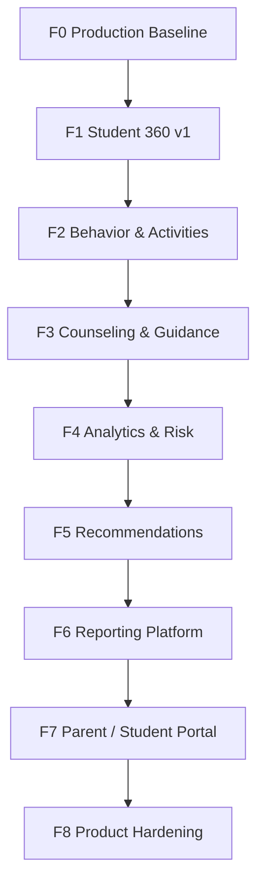

# نقشه‌راه محصول کامل هم‌آموز

- وضعیت: مصوب برای جهت معماری؛ وضعیت هر قابلیت در سند traceability ثبت می‌شود.
- تاریخ: 2026-08-10
- منبع معماری فعلی: `docker-compose.yml`، `Backend/config/api_urls.py`، `Frontend/src/core/router.js` و مستندات شماره‌دار Backend.

## زمینهٔ تصمیم و سطح اطمینان

- تصمیم: معماری فعلی حفظ و capabilityها به‌صورت domain appهای additive اضافه شوند.
- مخاطب: توسعه‌دهندهٔ اصلی، reviewer فنی و مالک release.
- Driver: Codex برای تبدیل تصمیم‌های کاربر به artifact و تغییر کوچک F0؛ Navigator: کاربر/مالک repository برای policyهای عملیاتی و approval خارج از source.
- اطمینان: high برای ساختار source و CI خوانده‌شده؛ unknown برای تنظیم remote GitHub، staging، secret rotation و pilot زیرا در repository قابل مشاهده نبودند.

## تصمیم‌های قطعی

سیستم یک **modular monolith** می‌ماند:

```text
Browser Preact application (ES modules, RTL)
        -> Django REST API (/api/v1/)
        -> Domain apps | read compositions | workflows
        -> PostgreSQL
        -> Redis / Celery
        -> Filesystem local or private S3-compatible storage
```

- Frontend با Preact، HTM و ES moduleهای self-hosted اجرا می‌شود؛ وابستگی runtime به CDN یا package registry ندارد.
- Microservice، generic event table، `Student360` database model، DSL rule engine، ABAC فراگیر و dashboard cache/materialized view زودهنگام ساخته نمی‌شوند.
- `contracts/openapi.yaml` فقط از Backend تولید می‌شود و دستی ویرایش نمی‌شود.
- هر feature additive زیر `/api/v1/` اضافه می‌شود مگر تغییر breaking semantics مستند و تصویب شود.

## وضعیت مبنا

| قابلیت مبنا | شواهد فعلی | وضعیت |
|---|---|---|
| PostgreSQL 17، Redis، migration check، OpenAPI generation/validation/drift | `.github/workflows/backend-ci.yml` | موجود |
| Celery/Redis، MinIO/S3 smoke، coverage، backup/restore، image build | `.github/workflows/backend-ci.yml` | موجود |
| lint، تست مسیر/داده/امنیت/سیستم طراحی و production build فرانت | `.github/workflows/frontend-ci.yml` | موجود |
| Compose health endpoint | `docker-compose.yml`, `Backend/config/urls.py` | موجود |
| Clean-boot functional smoke | `scripts/docker-integration-smoke.sh`, job `integration-smoke` | local Docker Desktop green؛ نخستین GitHub green هنوز گیت است |
| Staging deploy، secret rotation record، protection remote، pilot | هیچ workflow/تنظیم قابل مشاهده در source نیست | عملیاتی/نیازمند تصمیم مالک |

## Dependency chain



F1 می‌تواند بعد از F0 مستقل deploy شود. F4 پیش از داده‌های F2/F3، F5 پیش از F4 و F7 پیش از visibility/approval policy شروع نمی‌شوند.

## Phaseها

| Phase | هدف و خروجی | Exit gate |
|---|---|---|
| F0 | commit قابل استقرار؛ Compose clean boot، health، login، dashboard، students، XLSX، report preview | clone تازه، CI سبز، smoke سبز، staging/restore/pilot تأییدشده |
| F1 | تبدیل route موجود `/students/:id` به Student 360 lazy read composition | endpointهای جدا، permission tests، UI lazy loading |
| F2 | `behavior` و `activities` با state/audit/attachment | transition و cross-scope tests سبز |
| F3 | `counseling` confidential boundary و `guidance` enrollment-bound | private-note denial، audit، transfer default-deny |
| F4 | `analytics` ruleهای Python versioned/explainable و reconciliation | golden tests و evidence versioned |
| F5 | `recommendations` human-reviewed و audience-specific | draft/review/approval workflow و visibility tests |
| F6 | ReportDraft/Template allowlist و official snapshot | snapshot reproducibility و PDF/Word acceptance |
| F7 | portal رابطه‌محور Parent/Student | IDOR/cross-school/release-policy tests |
| F8 | load/profile/index/monitoring/security/DR | production readiness review و rehearsal |

## مرزهای دامنهٔ هدف

```text
hamamooz/apps/
  core organizations accounts students academics attendance evaluations imports reports dashboard
  behavior activities counseling guidance analytics recommendations
```

`evaluations` دوباره طراحی نمی‌شود: `FRAMEWORK_VERSION = "1.0"` و catalog کنونی 74 شاخص در 9 حوزه را دارد. Monthly Evaluation نظر ساختاریافتهٔ evaluator است؛ Behavior/Activity evidence واقعیت رخ‌داده‌اند و نباید مستقیماً metric را mutate کنند.

## قواعد مشترک

1. هر endpoint Organization، School، object scope و مجوز action را server-side تعیین می‌کند.
2. Guide Teacher باید cohort مبتنی بر Enrollment داشته باشد؛ Counselor باید case scope مستقل داشته باشد؛ Parent باید Guardian→Student relationship معتبر داشته باشد.
3. FK ownership، constraint، index، `PROTECT` برای تاریخچه، soft delete در جای مناسب، immutable historical record و transition صریح برای هر domain جدید الزامی است.
4. اطلاعات محرمانهٔ Counseling در payload عمومی، portal، audit change یا log ثبت نمی‌شود.
5. هر API change همراه implementation، API test، schema generation، contract sync و frontend lint/test/build تحویل می‌شود.

## Definition of Done هر Phase

- domain model و state machine بازبینی شده‌اند؛ tenant/school isolation و permission test شده است.
- migration امن و قابل rollback است؛ PostgreSQL واقعی، API contract و concurrency coverage وجود دارد.
- CI Backend/Frontend و smoke سبز است؛ OpenAPI/catalog sync است.
- docs، audit policy، PII-safe logging، staging acceptance و rollback runbook به‌روزند.

جزئیات قابل اجرا در [spec معماری](../../spec/spec-architecture-full-product-v1.md) و [plan](../../plan/architecture-full-product-1.md) ثبت شده‌اند.

## Action log و تصمیم‌های باز

| اقدام | مالک | trigger بازبینی | وابستگی | وضعیت |
|---|---|---|---|---|
| اجرای نخست `integration-smoke` و ثبت check سبز | CI/repository owner | نخستین push یا PR مرتبط | GitHub Actions runner | باز |
| اجباری‌کردن Backend CI، Frontend CI و Integration Smoke در main | repository owner [ASK USER] | پیش از پذیرش F0 | دسترسی GitHub admin | باز |
| ثبت staging، secret inventory/rotation و rollback rehearsal | operations owner [ASK USER] | پیش از deploy/pilot | target و secrets | باز |
| تأیید retention/disclosure/break-glass Counseling | product/security owner [ASK USER] | پیش از F3 production | policy محصول | باز |
